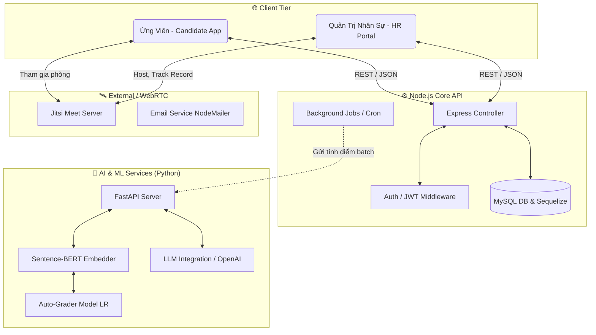

<div align="center">


  <h1>🚀 HỆ THỐNG TUYỂN DỤNG THÔNG MINH (AI-POWERED RECRUITMENT ATS)</h1>

  <p align="center">
    <strong>Tự động hóa toàn diện quy trình tuyển dụng: CV Matching, Trắc nghiệm trực tuyến, Chấm thi Tự luận tự động (Sentence-BERT), và Phỏng vấn WebRTC (Jitsi).</strong>
  </p>
  
  <p align="center">
    <b>🔗 Hệ Sinh Thái Dự Án (Ecosystem links):</b><br/>
    <a href="https://github.com/dpminhtri-dev-swe/smartpredict-frontend">🌐 Frontend (React.js)</a> &nbsp;|&nbsp;
    <a href="https://github.com/dpminhtri-dev-swe/smartpredict-backend">⚙️ Backend (Node.js)</a> &nbsp;|&nbsp;
    <a href="https://github.com/dpminhtri-dev-swe/smartpredict-python-training">🧠 AI/ML Engine (Python)</a>
  </p>

  <p align="center">
    
    
    
    
    
  </p>
</div>

---

## 📖 1. Tổng Quan Dự Án (Overview)

Đây là **Hệ Thống Quản Lý Tuyển Dụng (ATS - Applicant Tracking System)** quy mô lớn, được sinh ra để giải quyết bài toán "thắt cổ chai" thời gian của đội ngũ Nhân sự (HR). Dự án bao phủ toàn bộ vòng đời của ứng viên từ lúc nộp CV cho đến khi nhận việc (Onboarding). 

**Điểm khác biệt lớn nhất** là dự án tích hợp sâu **Trí Tuệ Nhân Tạo (AI)** và **Học Máy (Machine Learning)** vào các tác vụ cốt lõi: 
- Ứng dụng **LLM (LLaMA/OpenAI)** để phân loại câu hỏi đề thi và sinh nhận xét.
- Đào tạo mô hình **Sentence-BERT + Linear Regression** để **tự động chấm điểm thi Tự luận** chuẩn xác đến 85-92% so với con người.
- Tính toán độ tương đồng (Cosine Similarity) để **Matching CV ứng viên và mô tả công việc (JD)**.

> 🌟 **Nhiệm vụ của Repo này**: Đây là mã nguồn **Giao diện Người Dùng (Frontend)**. Đóng vai trò là điểm chạm trực quan, mượt mà giữa ứng viên ứng tuyển và hệ thống Quản trị nghiệp vụ của HR.

---

## ✨ 2. Các Tính Năng Cốt Lõi (Key Features)

### 👩‍💼 Dành cho Nhà Tuyển Dụng (HR)
* **Quản lý Ngân hàng Câu hỏi:** Upload đề bằng Word/PDF, Regex parser siêu tốc. Tự động dùng LLM để phân loại (độ khó, chủ đề, định dạng).
* **Tuyển & Chấm CV bằng AI:** Truy xuất văn bản qua LLM và so khớp trực tiếp CV ứng viên với Job Description (Matching Score) để xếp hạng tự động.
* **Cấu hình Bài Test Thời Gian Thực:** Setup phòng thi trực tuyến có thời gian đếm ngược với tính năng chặn gian lận cơ bản.
* **Quản lý Phỏng vấn Trực tuyến:** Tích hợp giải pháp Video Call WebRTC qua **Jitsi Meet**. Đi kèm tính năng **Quay hình buổi phỏng vấn (Screen & Audio Recording)** bằng Native Browser API và auto upload.

### 👨‍💻 Dành cho Ứng Viên (Candidate)
* **Portal Ứng tuyển thông minh:** Tự động parse (bóc tách data từ CV) bằng AI ngay khi bạn vừa upload file PDF. Quản lý luồng trạng thái nộp giấy tờ (Onboarding Docs).
* **Làm bài Thi Trực Tuyến êm ái:** Cơ chế Auto-save liên tục, đếm ngược real-time, giao diện tối ưu làm bài thi tự luận/trắc nghiệm tốc độ cao. Xem lại đáp án và lời khuyên chuẩn xác dựa trên LLM Response.

### 🤖 Trái tim AI/ML (Machine Learning Engine)
* **Auto-Grading (Hệ thống chấm thi tự luận):** Thuật toán tự động sinh Data Train từ đáp án chuẩn gốc. Ứng dụng mô hình **Sentence-BERT** kết hợp Linear Regression để chấm điểm cho hàng chục bài làm của ứng viên dưới 0.2s.

---

## 🏗️ 3. Kiến Trúc Hệ Thống (System Architecture)

Dự án được xây dựng theo mô hình **Microservices** giao tiếp qua REST HTTP để tối ưu tách bạch tài nguyên giữa Luồng Web và các tác vụ nặng (Train ML Model/Xử lý ngôn ngữ tự nhiên).



* **Frontend (React)** bao bọc toàn bộ luồng User Experience (UX), tương tác liên tục đến Server chính.
* **Backend (Node.js)** xử lý nghiệp vụ, quản lý trạng thái luồng phỏng vấn, trigger Email, lưu Metadata bài thi.
* **ML Service (Python)** là trái tim của hệ thống chấm bài. Chỉ nhận data thô và Request, sau đó sinh Embeddings và dự đoán điểm số trả về.

---

## 🛠️ 4. Tech Stack Chuyên Sâu

### 🌐 Giao diện Người Dùng (Frontend)
- **Framework Core**: `React.js` (Class & Hooks Components).
- **Bộ UI & Tương tác**: `Ant Design` (Bảng dữ liệu, Modal, Feedback), `Bootstrap 5` (Grid System, Layouting).
- **Hiệu ứng & Hoạt ảnh**: `GSAP` (Tạo chuyển động mượt mà), `AOS` (Scroll Animations).
- **Quản lý Dữ liệu**: `Axios` (HTTP Client interceptors), `React Router v6`.
- **Thư viện nghiệp vụ**: `@jitsi/react-sdk` (Nhúng iFrame WebRTC), `Chart.js` (Thống kê số liệu HR Dashboard).

### ⚙️ & 🧠 Máy chủ và AI (Backend / Machine Learning)
> Repositories liên quan: [Root Folder / Backend] | [Root Folder / ML-Grader]

- **Node.js**: Phục vụ API RESTful, dùng `Sequelize ORM` gọi MySQL. Sử dụng `multer` và `pdf-parse` để bóc tách tệp.
- **Python (FastAPI)**: Chạy Data pipelines. Dùng `scikit-learn` huấn luyện các hàm Regression. `Sentence-transformers` để encode Text-to-Vector thành 384 dimensions.

---

## 📂 5. Cấu Trúc Thư Mục Frontend Tham Khảo

Codebase cực kỳ lớn lên đến hàng trăm files, được sắp xếp module hóa với triết lý separation-of-concerns:

```text
├── public/                 # Ảnh, CSS tĩnh, và file index.html tổng
├── src/
│   ├── components/         # Các mảnh UI dùng chung (Buttons, Modal Layout, Header...)
│   ├── layouts/            # Cấu trúc khung trang (HR Layout, Candidate App Layout)
│   ├── page/               # Screen logic (Màn Danh sách Job, Màn test thi, Jitsi Meeting room) 
│   ├── routes/             # Cấu hình định tuyến (Protected/Public routes)
│   ├── service.js/         # Khoanh vùng mọi thao tác gọi HTTP API (Axios calls)
│   ├── utils/              # Các Helper Regex, Format Date, Format Currency, Auth Token check
│   ├── App.js              # Entry Component chứa Routing
│   └── index.js            # Dom rendering
└── package.json
```

---

## 🚦 6. Hướng Dẫn Cài Đặt Khởi Chạy (Quick Start)

Dành cho Developers muốn test và build mã nguồn Frontend trên Local. 

**Yêu cầu cơ bản:** `Node.js >= v16.x`, `npm >= 8.x`.

### Cài đặt:

```bash
# 1. Tải toàn bộ Source code, di chuyển vào đúng thư mục frontend
cd path/to/your/repo/frontend

# 2. Cài tất cả các gói dependencies cần thiết
npm install

# 3. Kéo server chạy trực tiếp ở chế độ Development (Nóng)
npm start
```
Vui lòng truy cập [http://localhost:3000](http://localhost:3000) trên trình duyệt. Mọi chỉnh sửa mã nguồn sẽ được reload tự động (HMR).

**Build cho môi trường Production (Triển khai):**
```bash
npm run build
```
Lệnh này sẽ nén tối ưu bộ mã nguồn, đẩy vào thư mục `/build` sẵn sàng cho Nginx hoặc dịch vụ Vercel/Netlify.

---

<p align="center">
  <b>Made with ❤️ by Developer - Xây dựng với một kiến trúc khủng, tối ưu cho ATS tương lai.</b>
</p>
